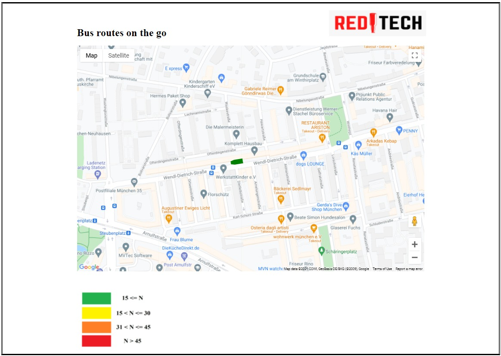

# TUM Hackathon Code Repository

Goal of the hackathon challenge was to estimate number of people in the public transport and show to the user how
crowded the vehicle is.

The solution idea is to put a Raspberry Pi near the bus driver and have it sniff for Wi-Fi probe packets.

Based on the data Raspberry Pi would get, an machine algorithm is proposed that would estimate number of passengers based on 
this information.

## Codebase structure

```
data_exploration.ipynb: Notebook in which initial data exploration was done
process_data.ipynb: Notebook for data cleaning and filtering
model/
    - data_load.py: Torch data loader definition
    - model.py: Torch model definition
    - train.py: Script for model training
```

## Counting problem and MAC addresses

Every device that can connect to Wi-Fi is constantly sending probe requests in every direction.
These packets are used to signal to the router that this device is nearby and that it is looking to connect.

In every probe request that the device sends has in it the MAC address of the device.
MAC address is unique identifier of a device, but modern protocols can be designed to randomized so that the user
fingerprinting cannot be done.

## Solution approach

Before any counting we wanted to ensure there are no signals from outside of the bus.
These signals can be from people outside of the bus, in cars or on the sidewalk.

This filtering was done based on _rssi_ strength, cutting of on 30 meters distance from
Raspberry Pi converted to signal strength in given medium in dB.

Example of signal strength distribution between two bus stations.


Instead of trying to derandomize MAC addresses we opted for different approach.
We plotted number of signals Pi got over time between two bus stops and trained 
convolutional neural network on it trying to classify density of the crowd (low, medium, heigh, very heigh).


This approach was based on [**IoT Device Fingerprint using Deep Learning**](https://arxiv.org/pdf/1902.01926)
## Visualization

Simple pure js website was developed to visualize bus route and color code it based on number of passengers.

